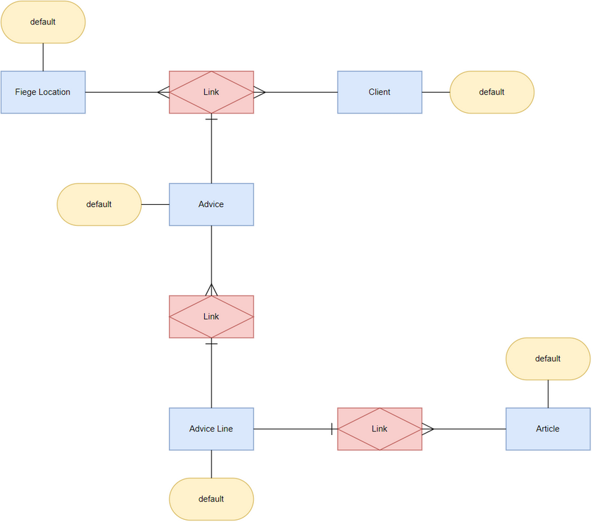

# Overview for Diagram **Ensemble3**:

## recognized shapes from b.telligent Shape Library:

|Shape ID|Shape Type|Label|
|--------|----------|-----|
|Ensemble3.CRDZAX5_v3VsPTcbH_Vh-15|Hub|Client|
|Ensemble3.CRDZAX5_v3VsPTcbH_Vh-16|Satellite|default|
|Ensemble3.CRDZAX5_v3VsPTcbH_Vh-18|Hub|Fiege Location|
|Ensemble3.CRDZAX5_v3VsPTcbH_Vh-19|Satellite|default|
|Ensemble3.CRDZAX5_v3VsPTcbH_Vh-21|Hub|Advice|
|Ensemble3.CRDZAX5_v3VsPTcbH_Vh-22|Satellite|default|
|Ensemble3.CRDZAX5_v3VsPTcbH_Vh-24|Link|Link|
|Ensemble3.CRDZAX5_v3VsPTcbH_Vh-28|Hub|Advice Line|
|Ensemble3.CRDZAX5_v3VsPTcbH_Vh-29|Satellite|default|
|Ensemble3.CRDZAX5_v3VsPTcbH_Vh-32|Link|Link|
|Ensemble3.CRDZAX5_v3VsPTcbH_Vh-35|Hub|Article|
|Ensemble3.CRDZAX5_v3VsPTcbH_Vh-36|Satellite|default|
|Ensemble3.CRDZAX5_v3VsPTcbH_Vh-38|Link|Link|

## recognized connections from b.telligent Shape Library:

|Source Type|Source Label|Connection Type|Label|Target Type|Target Label|Connection ID|Source ID|Target ID|
|-----------|------------|---------------|-----|-----------|------------|-------------|---------|---------|
|Satellite|default|Hub-to-Sat||Hub|Client|Ensemble3.CRDZAX5_v3VsPTcbH_Vh-17|Ensemble3.CRDZAX5_v3VsPTcbH_Vh-16|Ensemble3.CRDZAX5_v3VsPTcbH_Vh-15
|Satellite|default|Hub-to-Sat||Hub|Fiege Location|Ensemble3.CRDZAX5_v3VsPTcbH_Vh-20|Ensemble3.CRDZAX5_v3VsPTcbH_Vh-19|Ensemble3.CRDZAX5_v3VsPTcbH_Vh-18
|Satellite|default|Hub-to-Sat||Hub|Advice|Ensemble3.CRDZAX5_v3VsPTcbH_Vh-23|Ensemble3.CRDZAX5_v3VsPTcbH_Vh-22|Ensemble3.CRDZAX5_v3VsPTcbH_Vh-21
|Hub|Advice|Hub-to-Link-1||Link|Link|Ensemble3.CRDZAX5_v3VsPTcbH_Vh-25|Ensemble3.CRDZAX5_v3VsPTcbH_Vh-21|Ensemble3.CRDZAX5_v3VsPTcbH_Vh-24
|Hub|Fiege Location|Hub-to-Link-N||Link|Link|Ensemble3.CRDZAX5_v3VsPTcbH_Vh-26|Ensemble3.CRDZAX5_v3VsPTcbH_Vh-18|Ensemble3.CRDZAX5_v3VsPTcbH_Vh-24
|Hub|Client|Hub-to-Link-N||Link|Link|Ensemble3.CRDZAX5_v3VsPTcbH_Vh-27|Ensemble3.CRDZAX5_v3VsPTcbH_Vh-15|Ensemble3.CRDZAX5_v3VsPTcbH_Vh-24
|Satellite|default|Hub-to-Sat||Hub|Advice Line|Ensemble3.CRDZAX5_v3VsPTcbH_Vh-30|Ensemble3.CRDZAX5_v3VsPTcbH_Vh-29|Ensemble3.CRDZAX5_v3VsPTcbH_Vh-28
|Hub|Advice Line|Hub-to-Link-1||Link|Link|Ensemble3.CRDZAX5_v3VsPTcbH_Vh-33|Ensemble3.CRDZAX5_v3VsPTcbH_Vh-28|Ensemble3.CRDZAX5_v3VsPTcbH_Vh-32
|Hub|Advice|Hub-to-Link-N||Link|Link|Ensemble3.CRDZAX5_v3VsPTcbH_Vh-34|Ensemble3.CRDZAX5_v3VsPTcbH_Vh-21|Ensemble3.CRDZAX5_v3VsPTcbH_Vh-32
|Satellite|default|Hub-to-Sat||Hub|Article|Ensemble3.CRDZAX5_v3VsPTcbH_Vh-37|Ensemble3.CRDZAX5_v3VsPTcbH_Vh-36|Ensemble3.CRDZAX5_v3VsPTcbH_Vh-35
|Hub|Advice Line|Hub-to-Link-1||Link|Link|Ensemble3.CRDZAX5_v3VsPTcbH_Vh-39|Ensemble3.CRDZAX5_v3VsPTcbH_Vh-28|Ensemble3.CRDZAX5_v3VsPTcbH_Vh-38
|Hub|Article|Hub-to-Link-N||Link|Link|Ensemble3.CRDZAX5_v3VsPTcbH_Vh-40|Ensemble3.CRDZAX5_v3VsPTcbH_Vh-35|Ensemble3.CRDZAX5_v3VsPTcbH_Vh-38
